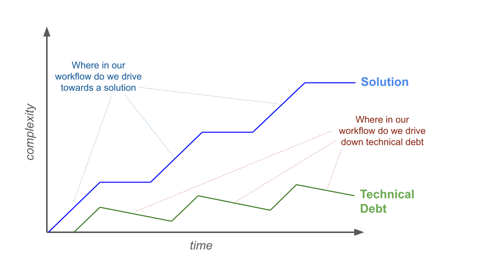

## Workflow Tutorial

### Definition

**Workflow**: A set of predefined actions and constraints that guides the sequence of steps an AI agent takes to accomplishing a task.

**Workflow Pattern**: Generalized patterns for different workflows that have been shown to be successful for certain problems.

### Example

>> 1. **Region defined** — via coordinates or `sliderule-region-picker`.
>> 2. **Request planned** — via `sliderule-params`, which consults
>>    `sliderule-openapi` for parameter definitions and defaults, plus
>>    the curated `parameter_couplings.md` reference for known couplings.
>>    Produces the `parms` dict.
>> 3. **Request executed** — this skill. POST to the Processing API's
>>    `/source/{api}.arrow`.
>> 4. **Response parsed** — read the Parquet into a DataFrame, extract the
>>    `meta`/`sliderule`/`recordinfo` metadata blocks from the schema, and
>>    resolve column meanings via `sliderule-openapi`.
>> 5. **Optional SQL/pandas pass** — filter, aggregate, or join the Parquet
>>    (DuckDB or pandas) before charting.
>> 6. **Optional orchestration** — `sliderule-pipeline` combines steps
>>    3–5 into a single script with task-metrics reporting.
>>
>> For scientific meaning of values in the response, consult
>> `nsidc-reference`.

This workflow was provided in an early set of _SlideRule_ skills we developed to reduce hallucinations and cost when AI agents interacted with SlideRule.

* Using early Claude models, we observed Claude Code iterating over multiple request/analysis passes that consumed both tokens and SlideRule resources; by requiring Claude to plan out what request it would make prior to making the request, we found it used fewer SlideRule requests to arrive at an answer.

* Directing Claude to specific resources that were up-to-date definitions of our API with annotated guidance targeted for AI agents, we found it made fewer mistakes.

NOTE - Ellie to interject here on how we interact with these systems

### Considerations

#### Question (1) - Is executor of the workflow an `agent` or a `human`?

A user (or `human`) executed **workflow** is how we approach an AI system regardless of how that system is defined or configured.  It is the soft-skill of proficiently using AI agents through workflow structured interactions.

>> Example of when I first started using copilot to modify a web application. I asked it to make a change and it failed to produce an acceptable code change.  Carlos then taught me to first ask it to explain the code base (`research`), then iterate with it on a `plan` to make the change, and once satisfied, ask it to them `implement` that plan.  The result was exactly what I wanted.

`Agent` **workflows** are hardcoded and/or configured behaviors executed by the agent itself.

>> Example of _skills_ that we provide (see example), _prompts_ that MCP servers provide, _orchestration_ that Claude Code provides.

#### Question (2) - Is the targeted output of your workflow `code` or an `answer`?

The desired output of our workflow may be `code` even if our ultimate goal is an answer.  By using code to provide the answer we are effectively using AI to develop a configuration managed, reviewable, and repeatable sequence of steps to arrive at our answer.

>> Example - generate a python script to compare yearly snowfall in the midwest.

But there are many cases when we just want the `answer` and do not need to know how that answer was arrived at.  This is sometimes referred to as staying fulling in __semantic space__.  In such cases, a **workflow** can be used to address the needs for configuration management, provenance, and reproducibility.

>> Example - how much snow in inches falls in the state of Colorado each year from 2010 to 2020.

#### Question (3) - Is the goal of the workflow to reduce `cost`, increase `robustness`, or improve `determinism`?

`Cost` can refer to token usage (consumed by the LLM) or it can also refer to external data systems the AI agents interact with.

`Robustness` is how correct an answer is and the likelihood that there are no hallucinations.

`Determinism` is how repeatable and predictable the behavior of the system is.

Sometimes `cost` and `robustness` are related; e.g. we can optimized for correctness at the expense of increased token usage.  But sometimes we can use **workflows** to optimzed both; e.g. if we know our problem space ahead of time we can define workflows that use external resources and internal guidance to more efficiently arrive at the best answers,

### Functions

* Sequence of actions

* Manage the context window

* Guide the selection of tool calls and skills

* Constrain behaviors

* Validate results

* Prompt users

#### Proposed Mental Model (for coders)

